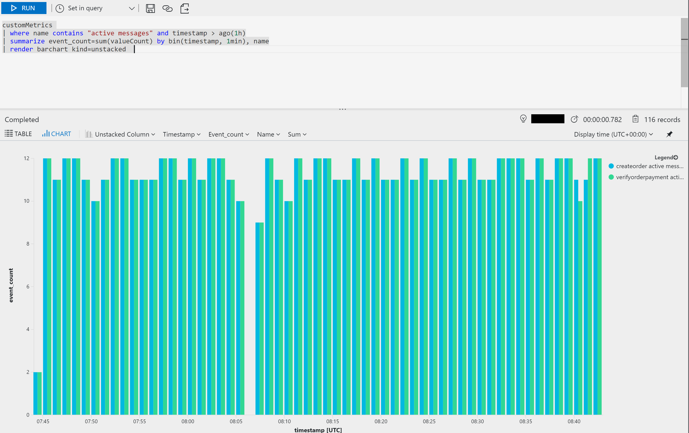

# Monitoring Service Fabric Application

## Disclamer

This is not the absolute guide to setup Service Fabric cluster and application monitoring/logging, it is just a quick starter to those that want to use **Log Analytics** to monitor the cluster and **Application Insights** to monitor the application.

## Application Insights

This document explains how to setup Application Insights in a Service Fabric Service application. It has been built from a collection of different sources (check references).
For complete guide [check the Application Insights for Service Fabric repository](https://github.com/Microsoft/ApplicationInsights-ServiceFabric)

### ASP.NET Core (Kestrel)

1. Ensure Application Insights has been added to service projects (click the project, Add, Application Insights)

2. Add nuget packages:
    - Microsoft.ApplicationInsights.ServiceFabric.Native (in preview)

3. Setup Application Insights for the project by modifying CreateServiceInstanceListeners
<pre>
protected override IEnumerable<ServiceInstanceListener> CreateServiceInstanceListeners()
{
    return new ServiceInstanceListener[]
    {
        new ServiceInstanceListener(serviceContext =>
            new KestrelCommunicationListener(serviceContext, "ServiceEndpoint", (url, listener) =>
            {
                ServiceEventSource.Current.ServiceMessage(serviceContext, $"Starting Kestrel on {url}");

                return new WebHostBuilder()
                            .UseKestrel()
                            .ConfigureServices(
                                services => services
                                    .AddSingleton&lt;StatelessServiceContext&gt;(serviceContext)
                                    <b>.AddSingleton&lt;ITelemetryInitializer&gt;((serviceProvider) => FabricTelemetryInitializerExtension.CreateFabricTelemetryInitializer(serviceContext)))</b>
                            .UseContentRoot(Directory.GetCurrentDirectory())
                            .UseStartup&lt;Startup&gt;()
                            .UseServiceFabricIntegration(listener, ServiceFabricIntegrationOptions.None)
                            .UseUrls(url)
                            <b>.UseApplicationInsights()</b>
                            .Build();
            }))
    };
}
</pre>

### Using OWIN

For OWIN based web applications hosted in Service Fabric to the following:

1. Ensure Application Insights has been added to service projects (click the project, Add, Application Insights)

2. Add nuget packages:
    - Microsoft.ApplicationInsights.ServiceFabric.Native (in preview)
    - Microsoft.ApplicationInsights.PerfCounterCollector
    - Microsoft.ApplicationInsights.DependencyCollector
    - ApplicationInsights.OwinExtensions

3. Modify **ApplicationInsights.config** to include dependency tracking and live stream support
```xml
<?xml version="1.0" encoding="utf-8"?>
<ApplicationInsights xmlns="http://schemas.microsoft.com/ApplicationInsights/2013/Settings">
  <InstrumentationKey>...</InstrumentationKey>
  <TelemetryInitializers>
    <Add Type="Microsoft.ApplicationInsights.ServiceFabric.FabricTelemetryInitializer, Microsoft.AI.ServiceFabric"/>
    <Add Type="ApplicationInsights.OwinExtensions.OperationIdTelemetryInitializer, ApplicationInsights.OwinExtensions"/>
    <!-- Enrich telemetry with Component Version -->
    <Add Type="Microsoft.ApplicationInsights.ServiceFabric.CodePackageVersionTelemetryInitializer, Microsoft.AI.ServiceFabric.Native"/>

  <!-- In order to collect dependencies include this and the nuget package Microsoft.ApplicationInsights.DependencyCollector -->
  <Add Type="Microsoft.ApplicationInsights.DependencyCollector.HttpDependenciesParsingTelemetryInitializer, Microsoft.AI.DependencyCollector"/>
  </TelemetryInitializers>
  <TelemetryModules>
    <!-- In order to collect dependencies include this and the nuget package Microsoft.ApplicationInsights.DependencyCollector -->
    <Add Type="Microsoft.ApplicationInsights.DependencyCollector.DependencyTrackingTelemetryModule, Microsoft.AI.DependencyCollector"/>
    
    <!--  In order to collect performance/request information include this and the nuget package Microsoft.ApplicationInsights.PerfCounterCollector -->
    <Add Type="Microsoft.ApplicationInsights.Extensibility.PerfCounterCollector.PerformanceCollectorModule, Microsoft.AI.PerfCounterCollector"/>
    <Add Type="Microsoft.ApplicationInsights.Extensibility.PerfCounterCollector.QuickPulse.QuickPulseTelemetryModule, Microsoft.AI.PerfCounterCollector"/>
    
    <!-- Add this if you are using Remoting V2 -->
    <!--
    <Add Type="Microsoft.ApplicationInsights.ServiceFabric.Module.ServiceRemotingRequestTrackingTelemetryModule, Microsoft.AI.ServiceFabric.Native"/>
    <Add Type="Microsoft.ApplicationInsights.ServiceFabric.Module.ServiceRemotingDependencyTrackingTelemetryModule, Microsoft.AI.ServiceFabric.Native"/>
    <Add Type="Microsoft.ApplicationInsights.ServiceFabric.FabricTelemetryInitializer, Microsoft.AI.ServiceFabric"/>
    -->
  </TelemetryModules>
  <TelemetryProcessors>
    <!-- Adds support to live stream -->
    <Add Type="Microsoft.ApplicationInsights.Extensibility.PerfCounterCollector.QuickPulse.QuickPulseTelemetryProcessor, Microsoft.AI.PerfCounterCollector"/>
  </TelemetryProcessors>
</ApplicationInsights>
```

4. Setup Application Insights for the project on the **Startup** class

<pre>
using ApplicationInsights.OwinExtensions;
using Owin;
using System.Net.Http.Formatting;
using System.Net.Http.Headers;
using System.Web.Http;

public class Startup : IOwinAppBuilder
{    
    public void Configuration(IAppBuilder appBuilder)
    {
        var config = new HttpConfiguration();
        ...
        <b>appBuilder.UseApplicationInsights();</b>

        appBuilder.UseWebApi(config);
    }
}    
</pre>

5. Modify CreateServiceInstanceListeners, adding service call context
```c#
protected override IEnumerable<ServiceInstanceListener> CreateServiceInstanceListeners()
{
    FabricTelemetryInitializerExtension.SetServiceCallContext(this.Context);
    return new ServiceInstanceListener[]
    {
        new ServiceInstanceListener(serviceContext => new OwinCommunicationListener(Startup.ConfigureApp, serviceContext, ServiceEventSource.Current, "ServiceEndpoint"))
    };
}
```

## Remoting correlation
The package Microsoft.AI.ServiceFabric.Native allows the [correlation of remoting calls](https://github.com/Microsoft/ApplicationInsights-ServiceFabric#trace-correlation-with-service-remoting).


### For Remoting V1

Use a `CorrelatingServiceProxyFactory` when creating the proxy
```c#
var proxyFactory = new CorrelatingServiceProxyFactory(this.serviceContext, callbackClient => new FabricTransportServiceRemotingClientFactory(callbackClient: callbackClient));
IStatelessBackendService proxy = proxyFactory.CreateServiceProxy<IStatelessBackendService>(new Uri(serviceUri));
```

In the service receiving the remoting call add correlation handlers in the service instance listener
```c#
protected override IEnumerable<ServiceInstanceListener> CreateServiceInstanceListeners()
{
    yield return new ServiceInstanceListener(context => new FabricTransportServiceRemotingListener(context, new CorrelatingRemotingMessageHandler(context, this)));
}
```

### For Remoting V2

#### Using ASP.NET Core / Kestrel

Add the two modules using Dependency Injection
```c#
ConfigureServices(services => services
    ...
    .AddSingleton<ITelemetryModule>(new ServiceRemotingDependencyTrackingTelemetryModule())
    .AddSingleton<ITelemetryModule>(new ServiceRemotingRequestTrackingTelemetryModule())
)
```

#### Using OWIN

Add telemtry modules to file **ApplicationInsights.config**
```xml
<TelemetryModules>
    ...
    <Add Type="Microsoft.ApplicationInsights.ServiceFabric.Module.ServiceRemotingRequestTrackingTelemetryModule, Microsoft.AI.ServiceFabric.Native"/>
    <Add Type="Microsoft.ApplicationInsights.ServiceFabric.Module.ServiceRemotingDependencyTrackingTelemetryModule, Microsoft.AI.ServiceFabric.Native"/>
</TelemetryModules>
```

## Extras

### Using an application to generate custom metrics about queue size

**Create Service Fabric application to create metrics**

Create a service with 1 instance running that every x seconds checks the queue length, creating a metric on Application Insights
```c#
/// <summary>
/// This is the main entry point for your service instance.
/// </summary>
/// <param name="cancellationToken">Canceled when Service Fabric needs to shut down this service instance.</param>
protected override async Task RunAsync(CancellationToken cancellationToken)
{
    FabricTelemetryInitializerExtension.SetServiceCallContext(this.Context);

    long iterations = 1;
    var nsmgr = NamespaceManager.CreateFromConnectionString("<service-bus-connection-string>");
    while (true)
    {
        cancellationToken.ThrowIfCancellationRequested();

        ServiceEventSource.Current.ServiceMessage(this.Context, "Working-{0}", ++iterations);

        await TrackQueueMeasure(nsmgr, "orders-queue");
        await TrackQueueMeasure(nsmgr, "payments-queue");
        
        // every 10 seconds create a measurement with each queue size
        await Task.Delay(TimeSpan.FromSeconds(10), cancellationToken);
    }
}

private async Task TrackQueueMeasure(NamespaceManager nsmgr, string queueName)
{
    var queue = await nsmgr.GetQueueAsync(queueName);
    telemetry.TrackMetric(new MetricTelemetry(queueName + " active messages", queue.MessageCountDetails.ActiveMessageCount));
    telemetry.TrackMetric(new MetricTelemetry(queueName + " deadletter messages", queue.MessageCountDetails.DeadLetterMessageCount));
}
```

**Use queries in Application Insights to see the queue size over time**

```
customMetrics 
| where name contains "active messages" and timestamp > ago(1h)
| summarize event_count=sum(valueCount) by bin(timestamp, 1min), name
| render barchart kind=unstacked
```


**Creating alerts based on custom metrics**


### Using Application Insights to track events

**Code to create event**
```c#
telemetryClient.TrackEvent("Order created", new Dictionary<string, string>() { { "orderId", createdOrder.Id.ToString() } });
```

**Query**
```
customEvents
| where timestamp > ago(1h) and name contains "Order"
| summarize event_count=sum(itemCount) by bin(timestamp, 5min), name
| render timechart
```


## References

- [Tutorial: monitor and diagnose an ASP.NET Core application on Service Fabric](https://docs.microsoft.com/en-us/azure/service-fabric/service-fabric-tutorial-monitoring-aspnet)
- [Microsoft Application Insights for Service Fabric](https://github.com/Microsoft/ApplicationInsights-ServiceFabric)