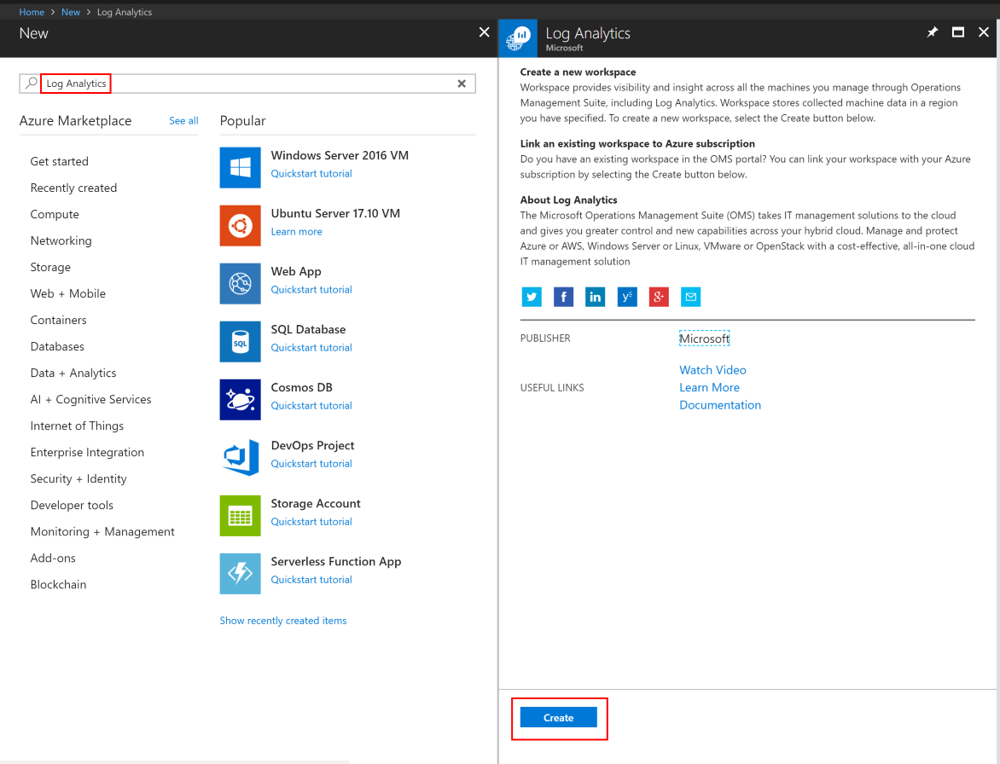
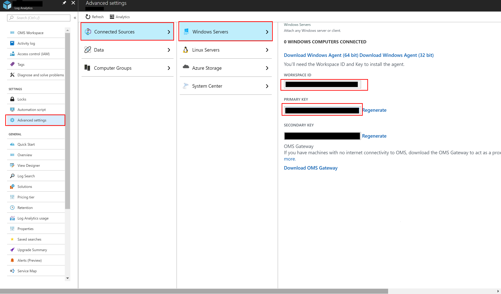
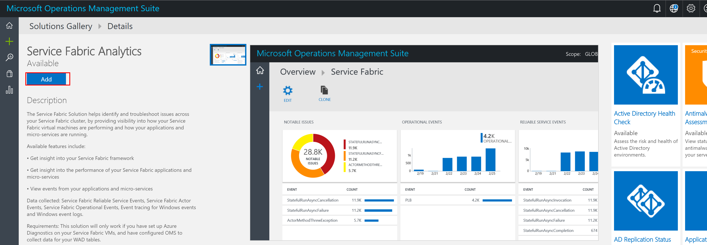
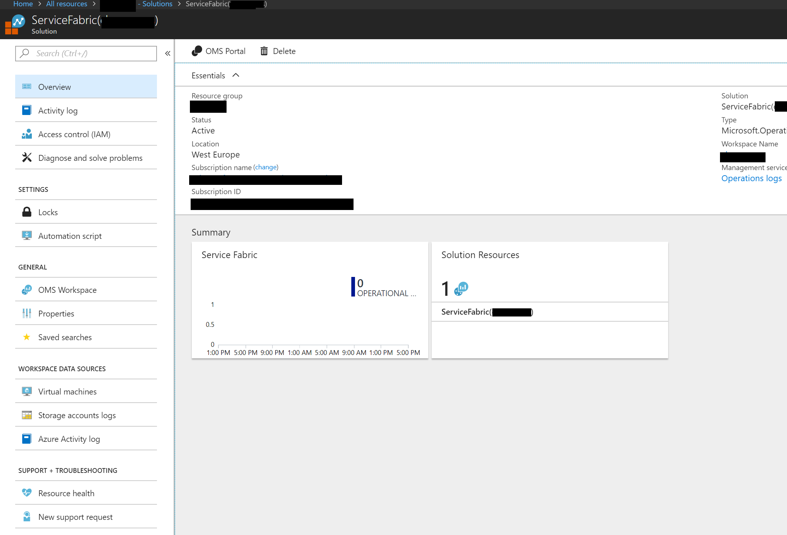
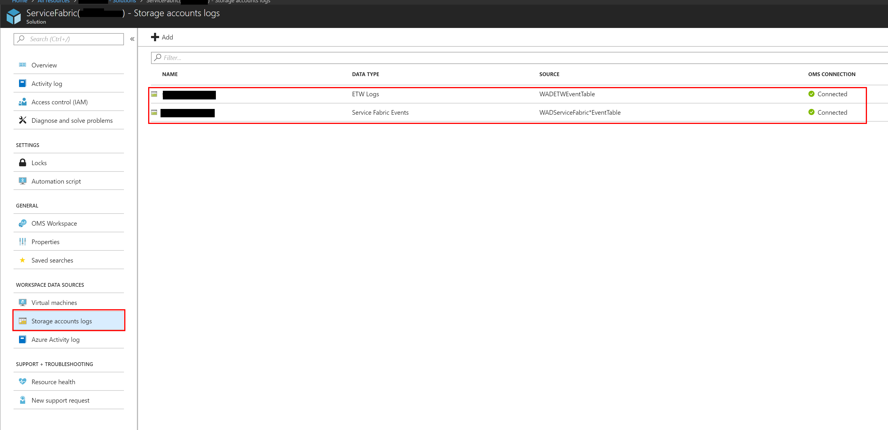
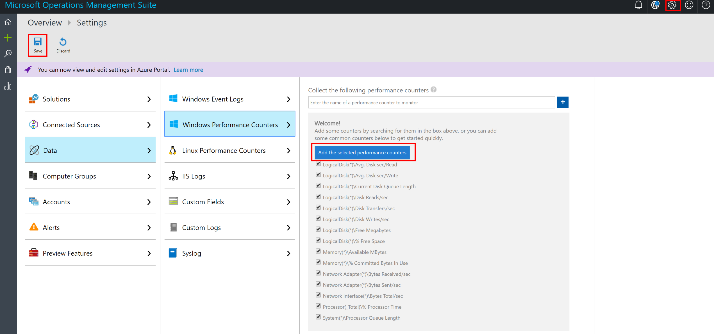
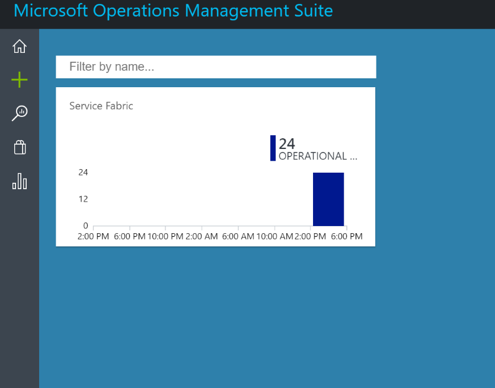
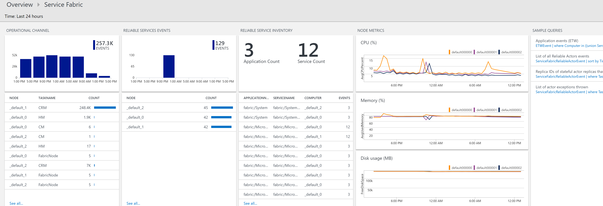

# Monitoring Service Fabric Cluster with Log Analytics

## Disclamer

This is not the absolute guide to setup Service Fabric cluster and application monitoring/logging, it is just a quick starter to those that want to use **Log Analytics** to monitor the cluster and **Application Insights** to monitor the application.

## Log Analytics

Log Analytics is an Azure service that provides a centralize log analytics for different Azure sources. To use it with Service Fabric we need to:

1. [Ensure we have a Log Analytics to send data to](#ensure-log-analytics)
2. [Install the OMS Agent in our Virtual Machine Scale set to collect information and send it to Log Analytics](#oms-agent)
3. [Install Service Fabric extension in Log Analytics](#service-fabric-extension)
4. [Select Performance Counters to collect](#performance-counters)

### <a name="ensure-log-analytics">1. Ensure we have a Log Analytics to send data to</a>
Make sure there is a Log Analytics resource in your subscription. If one does not exist, create a new one


### <a name="#oms-agent">2. Install OMS Agent in Virtual Machine Scale Sets to collect information from each virtual machine</a>

There two ways to accomplish it. During the creation using specific ARM template elements or after creation using the azure command line.

#### ARM Template
```json
{
    "name": "[concat('OMS','_vmNodeType0Name')]",
    "properties": {
        "publisher": "Microsoft.EnterpriseCloud.Monitoring",
        "type": "MicrosoftMonitoringAgent",
        "typeHandlerVersion": "1.0",
        "autoUpgradeMinorVersion": true,
        "settings":
        {
            "workspaceId": "[parameters('omsWorkspaceId')]"
        },
        "protectedSettings":
        {
            "workspaceKey": "[parameters('omsWorkspaceKey')]"
        }
    }
}
```

#### Azure Command Line
```bash
az vmss extension set --name MicrosoftMonitoringAgent --publisher Microsoft.EnterpriseCloud.Monitoring --resource-group <nameOfResourceGroup> --vmss-name <nameOfNodeType> --settings "{'workspaceId':'<OMSworkspaceId>'}" --protected-settings "{'workspaceKey':'<OMSworkspaceKey>'}"
```

#### Finding the Log Analytics id and key
To get the workspace id and key click on advanced settings and then "Connect Sources" / "Windows Server".


### <a name="service-fabric-extension">3. Install Service Fabric extension in Log Analytics</a>
1. Go to OMS portal
2. Click Solutions Gallery (shopping bag icon) and add "Service Fabric Analytics" to it
   

3. After installed search for the "ServiceFabric(xxx)" solution on Azure Portal, then click Storage accounts logs
   

4. Add the storage account for "ETW Logs menu" and for "Service Fabric Events". The selected storage account should have tables named "WADETWEventTable" and WADServiceFabric*EventTable"
   


   
### <a name="performance-counters">4. Select Performance Counters to collect</a>
1. Go to OMS Portal
2. Click "Settings" (gear icon on top right)
3. Select Data &rarr; Windows Performance Counters
4. Select Performance counters you wish to collect
5. Click "Add the selected performance counters"
6. Click save (top left)


## Conclusion

After a few minutes (in a Service Fabric cluster with active applications) data will start to show up in your Log Analytics instance. This is how it should look like:


Clicking on the chart will take you to the detailed view:


You can create your own queries to view the information you need. To help you get started take a look at the following queries (click on "Log Search" on the right menu and then "Analytics" under the title "Log Search":

**AVG CPU %**
```
Perf
| where CounterName == "% Processor Time" and TimeGenerated > ago(30min)
| summarize CPU = avg(CounterValue) by bin(TimeGenerated, 1min), Computer
| render timechart
```

**AVAILABLE DISK SPACE**
```
Perf
| where CounterName == "Free Megabytes" and InstanceName != "_Total" and TimeGenerated > ago(1d)
| summarize MB = avg(CounterValue) by ComputerAndDisk = strcat(Computer, "/Disk ", substring(InstanceName, 0, 1)), bin(TimeGenerated, 10m)
| render timechart 
```

**AVAILABLE RAM**
```
Perf
| where CounterName == "Available MBytes" and TimeGenerated > ago(1d)
| summarize FREE_RAM_MB = avg(CounterValue) by Computer, bin(TimeGenerated, 1m)
| render timechart
```

## Additional

### Adding Application Insights to Log Analytics

You can add the content of AI to Log Analytics. To do so add the solution "Application Insights Connector (Preview)" to your workspace. After in the OMS settings link  Application Insights key to OMS (Settings/Data/Application Insights). An Application Insights can only be added to a single OMS workspace.

## References

- [Monitoring and diagnostics for Azure Service Fabric](https://docs.microsoft.com/en-us/azure/service-fabric/service-fabric-diagnostics-overview)
- [Event aggregation and collection using Windows Azure Diagnostics](https://docs.microsoft.com/en-us/azure/service-fabric/service-fabric-diagnostics-event-aggregation-wad)
- [Assess Azure Service Fabric applications and micro-services with PowerShell](https://docs.microsoft.com/en-us/azure/log-analytics/log-analytics-service-fabric)
