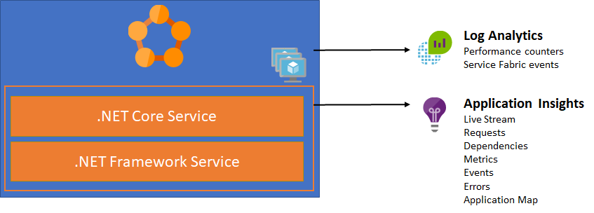

# Monitoring Service Fabric with Log Analytics and Application Insights

This document summarizes how you can use Log Analytics and Application Insights to monitor your Service Fabric cluster and the applications running on it respectively.

## Step by step guides

1. [Monitoring cluster with Log Analytics](LogAnalytics.md)
2. [Monitoring application with Application Insights](ApplicationInsights.md)

## References
- [Monitoring and diagnostics for Azure Service Fabric](https://docs.microsoft.com/en-us/azure/service-fabric/service-fabric-diagnostics-overview)
- [Event aggregation and collection using Windows Azure Diagnostics](https://docs.microsoft.com/en-us/azure/service-fabric/service-fabric-diagnostics-event-aggregation-wad)
- [Assess Azure Service Fabric applications and micro-services with PowerShell](https://docs.microsoft.com/en-us/azure/log-analytics/log-analytics-service-fabric)
- [Tutorial: monitor and diagnose an ASP.NET Core application on Service Fabric](https://docs.microsoft.com/en-us/azure/service-fabric/service-fabric-tutorial-monitoring-aspnet)
- [Microsoft Application Insights for Service Fabric](https://github.com/Microsoft/ApplicationInsights-ServiceFabric)